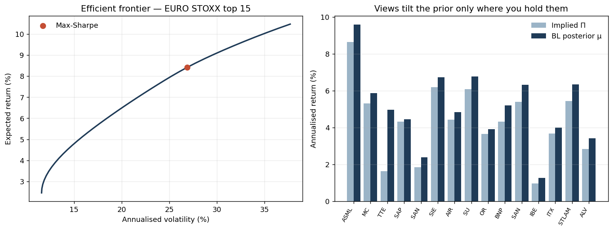

# Black-Litterman Portfolio Optimiser

[](https://github.com/ShrishDhuria/bl-portfolio-optimiser/actions/workflows/tests.yml)

A practitioner-grade implementation of the Black-Litterman model for European equity portfolio construction, applied to the SX5E top 15.

## What it demonstrates

Black-Litterman starts from the market-cap–implied equilibrium return Π and tilts it **only where you hold a view**, sizing each tilt by your stated confidence (Idzorek). That fixes the central pathology of plain mean-variance — wild, corner-solution weights from tiny perturbations in the expected-return inputs. With no views the posterior reproduces the cap-weighted market exactly; with a 100%-confidence view the view is honoured exactly. The figure shows the efficient frontier on the EURO STOXX top 15 (left) and how a moderate view shifts the posterior expected returns away from the prior only on the names it touches (right).



*Left: efficient frontier from the real covariance sweep, with the max-Sharpe point. Right: implied equilibrium Π vs the Black-Litterman posterior μ under one illustrative pair of views — the tilt is concentrated where the views apply. Regenerate with `python make_figures.py`.*

## Project goals
- Combine market equilibrium (CAPM-implied returns) with investor views via Bayesian shrinkage to produce stable, intuitive portfolios.
- Build parallel Python and Excel implementations to demonstrate both quantitative depth and tooling fluency.
- Interactive Streamlit dashboard for live view-entry, sensitivity analysis, and efficient-frontier visualisation.

## Methodology references
- Black, F. & Litterman, R. (1992). "Global Portfolio Optimization." *Financial Analysts Journal*.
- He, G. & Litterman, R. (1999). "The Intuition Behind Black-Litterman Model Portfolios." Goldman Sachs.
- Idzorek, T. M. (2005). "A Step-by-Step Guide to the Black-Litterman Model." Working paper.

## Project structure
```
bl-portfolio-optimiser/
├── market_data.py        # Phase 1 — prices, returns, covariance, weights, rf
├── equilibrium.py        # Phase 2 — reverse-optimisation → implied returns Π
├── views.py              # Phase 3 — P, Q, Ω construction (Idzorek)
├── bl_model.py           # Phase 4 — posterior μ and Σ computation
├── optimiser.py          # Phase 5 — mean-variance, max Sharpe, efficient frontier
├── app.py                # Phase 6 — Streamlit dashboard
├── sources.md            # Data provenance
├── requirements.txt
└── README.md
```

## Quick start
```bash
pip install -r requirements.txt
python market_data.py     # builds the data layer and exports CSVs
streamlit run app.py      # interactive dashboard
```

## Build status
- [x] Phase 1 — Data layer
- [x] Phase 2 — Equilibrium implied returns
- [x] Phase 3 — Views (Idzorek confidence mapping)
- [x] Phase 4 — BL posterior
- [x] Phase 5 — Optimiser (with concentration caps)
- [x] Phase 6 — Streamlit dashboard

## Limitations

Honest about what the model can and cannot do:

- **Inputs drive everything.** Π depends on the covariance estimate (Ledoit-Wolf shrinkage is used here) and on the risk-aversion coefficient λ (anchored to an assumed 5% ERP); the output is only as good as those.
- **τ is set by convention, not estimated.** The prior-scaling parameter (0.025) is a standard choice, and posterior weights are known to be sensitive to it — the dashboard's sensitivity view exists precisely because of this.
- **View confidence is judgment, not data.** The Idzorek mapping turns a stated confidence into Ω; it does not calibrate that confidence from any track record.
- **Single-period and largely unconstrained.** The objective is one-period mean-variance with a per-name cap; there are no transaction costs, turnover limits, or factor/sector constraints.
- **Covariance is estimated on ~3y of daily history** and assumed stationary — regime shifts and time-varying correlation are not modelled.

## Testing

A `pytest` suite under `tests/` covers the model's mathematical contracts —
the properties a reviewer is most likely to probe in an interview — rather than
just checking that functions run. All fixtures are synthetic, so the suite is
offline and fast.

- **No-views identity** — with an empty view set the posterior mean collapses
  exactly onto the equilibrium prior Π.
- **Confidence limits** — as Idzorek confidence → 0 the view is ignored
  (posterior → prior); at 100% confidence it is enforced exactly (`P · μ_BL = Q`).
- **Equilibrium round-trip** — `(1/λ) Σ⁻¹ Π = w_mkt` to machine precision.
- **Two-form cross-check** — the Theil and original Black-Litterman posteriors
  agree to ~1e-10.
- **Risk decomposition** — Euler risk contributions sum to portfolio volatility.
- **Well-posedness** — the posterior covariance stays symmetric and PSD; the
  optimisers respect the budget and per-name caps.

```bash
pip install -r requirements-dev.txt
pytest tests/ -q          # 9 tests
```

Tests run automatically on every push via GitHub Actions (`.github/workflows/tests.yml`).
